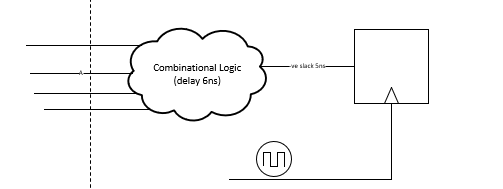
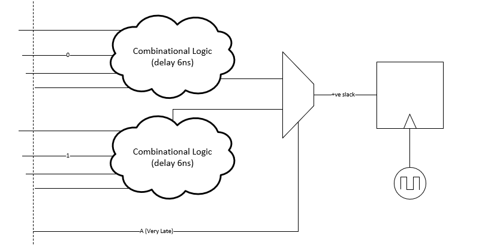

## How to fix Timing Violation For Very Late Signals ? 

In the below circuit, the signal A is arriving late and passing through a combinational circuit with 6ns delay and as a result it causes 5ns -ve slack.
How do you solve this problem without pipelining the combinational logic ? 

-All the other signals are comming on time. 
-The Signal A is 1-bit signal. 

Solution: 

We can dublicate the Combinational Circuit with A equals to 0 and 1 and make the Value A the selection signal for the MUX. In this case the value A skips the delay of the combinational logic and meets the timing. 

Advantages: 
- Timing Violations is resolved.
- We did not resign circuit.

Disadvantages: 
- Hardware is dublicated for the Combinational logic. 

