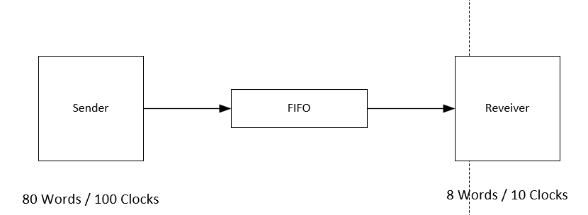
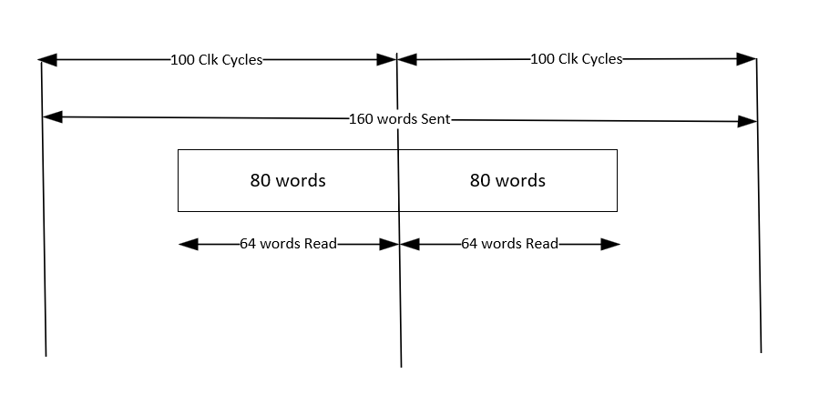

## Calculate the FIFO Depth ? (Burst Size Case)

Sender sends data at the rate of 80 words / 100 Clokcs 
Receiver can consume at the rate of 8 words / 10 Clokcs. 

### What should be the depth of the FIFO ?

Hints: 
- Always Consider the worst case.
- Read/Write speed may be the same but burst size matters.

Solution: 

In this case the Avarage speed is same! But the burst size is different so we need a fifo. 

- Total Words Written: 160
- Total Words Read: 128
- Words Leftover: 32

So the FIFO length should be at least 32. 

## Equation to Calculate the FIFO Depth ? 

Problem Statement: 
   Data Size: 80 Words 
   Writing : 100MHZ (Period - 10ns)
   Reading: 80MHZ (Period - 12.5ns)
Key Points:
   Data Rate: Size * Time Period 
   Diff: Data Rate(Slow) - Data Rate(Fast) 
   Depth: Diff/ Higher Freq Time Period

Solution: 
   Data Rate(Fast)= 80*10ns  = 800ns
   Data Rate(Slow)= 80*12.5ns= 1000ns
   Diff = 1000-800 = 200ns 

   Depth= 200ns/10ns = 20 

- The moment the Transmitter starts writing, Receiver can not start reading immediately because there is a certain letancy between the moment the transmitter starts writing and empty flag is deasserted and reciver reacts to it.
- If we calculate it based on the solution for the last problem, we would get FIFO depth of 16. But that is possible if we have ideal fifo and no latencies. So this method is more conservative way of calculating the fifo depth.  

   
   
   

   
   
   

   

