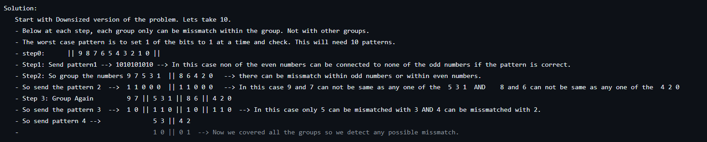

## How many Patterns are required to Detect a Missmatch ? 

Questiom: Block A drives 100 wires to block B. They are connected in order i.e index "n" of Block A connected to index "n" of BLock B. 

How will you check for a mismatch in connection ? What patterns are required ? 

Solution:
   Start with Downsized version of the problem. Lets take 10. 
   - Below at each step, each group only can be missmatch within the group. Not with other groups. 
   - The worst case pattern is to set 1 of the bits to 1 at a time and check. This will need 10 patterns.
   - step0:      || 9 8 7 6 5 4 3 2 1 0 ||
   - Step1: Send pattern1 --> 1010101010 --> In this case non of the even numbers can be connected to none of the odd numbers if the pattern is correct.  
   - Step2: So group the numbers 9 7 5 3 1  || 8 6 4 2 0   --> there can be missmatch within odd numbers or within even numbers.
   - So send the pattern 2  -->  1 1 0 0 0  || 1 1 0 0 0   --> In this case 9 and 7 can not be same as any one of the  5 3 1  AND    8 and 6 can not be same as any one of the  4 2 0
   - Step 3: Group Again         9 7 || 5 3 1 || 8 6 || 4 2 0
   - So send the pattern 3  -->  1 0 || 1 1 0 || 1 0 || 1 1 0  --> In this case only 5 can be mismatched with 3 AND 4 can be missmatched with 2.
   - So send pattern 4 -->              5 3 || 4 2
   -                                    1 0 || 0 1  --> Now we covered all the groups so we detect any possible missmatch.   
         
