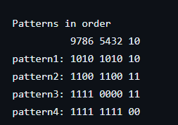

## How many Patterns are required to Detect a Missmatch ? 

Questiom: Block A drives 100 wires to block B. They are connected in order i.e index "n" of Block A connected to index "n" of BLock B. 

How will you check for a mismatch in connection ? What patterns are required ? 

So we need at least 4 patterns to detect any missmatch on 10 bits.  So the number of patterns required to detect missmatch is $clog2(number_of_wires).
