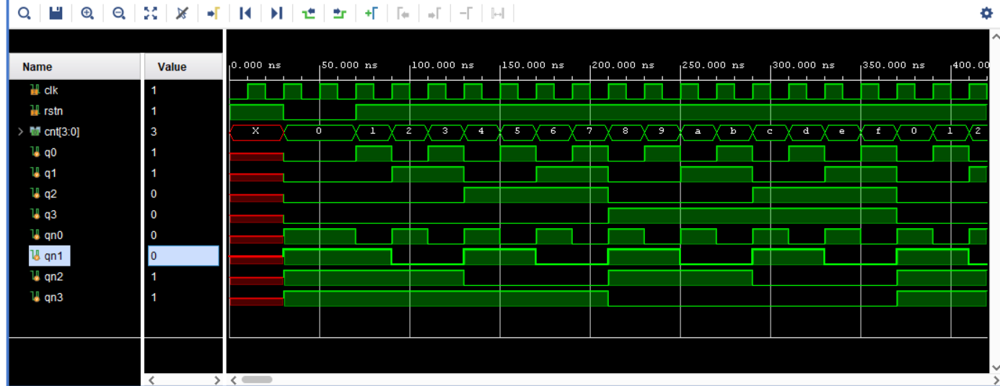

## Design a 4-bit Ripple Counter. 

Ripple counter is a cascaded arrangement of flip-flops where the output of one flip-flop drives the clock input of the following flip-flop.

- It is an asynchronous counter.
- Different flip-flops are used with a different clock pulse.
- All the flip-flops are used in toggle mode.
- Only one flip-flop is applied with an external clock pulse and another flip-flop clock is obtained from the output of the previous flip-flop.
- The flip-flop applied with an external clock pulse act as LSB (Least Significant Bit) in the counting sequence.

