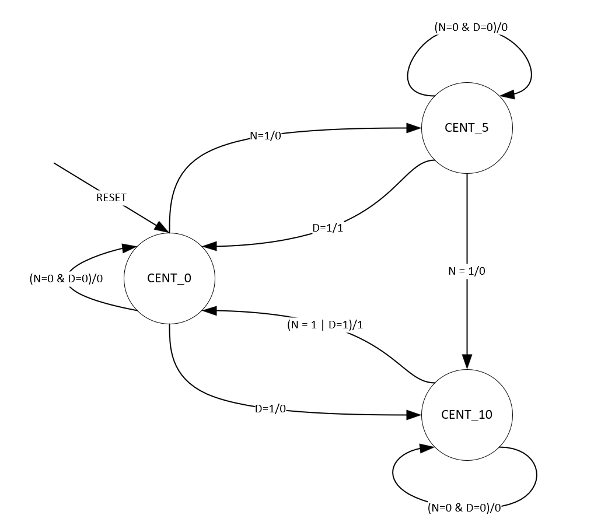

Design Develop systemvenlog Moore and Mealy FSM Requirements : 
- Dispatches a pack of candy upon deposit of 15 cents by the customer
- Has single coin slot and only accepts nickels(5 Cent) and dimes (10 Cents). Doesn't take pennies or quarters 
- Does not provide any change back to the customer 
- Once candy is dispatched, vending machine will auto reset itself 
- Develop both Moore and Mealy State SystemVerilog FSM code for Vending Machine 
- Develop state transition diagram for mealy state machine 
- Use one hot encoding for states and assume asynchronous active low reset 
- Note : DO NOT register output "open" in both mealy and moore implementation. 

-Primary port list : Input N, D, clk, rstn, output open     
Input clk (clock) 
Input rstn (synchronous reset / negedge signal) 
Input N, D (I-bit signals for Nickel and Dime) 
Output open(l-bit output. '1' when 15cents or more are deposited in vending machine) 

# MOORE FSM Implementation 

# MEALY FSM Implementation 

